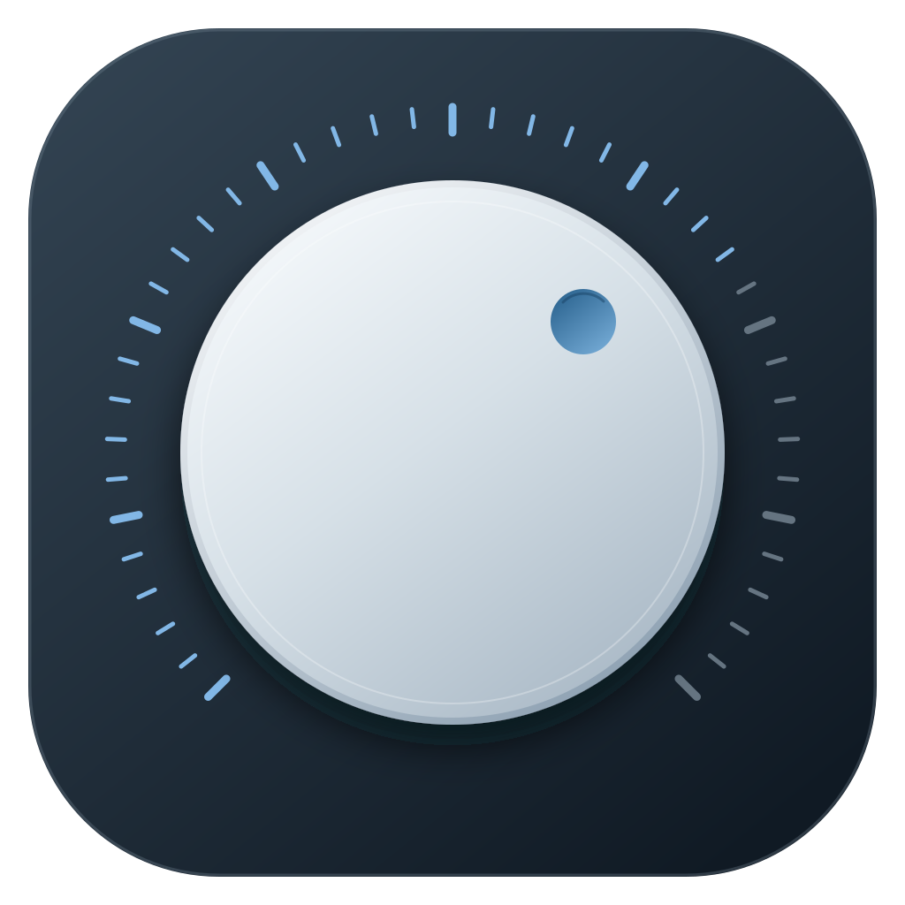
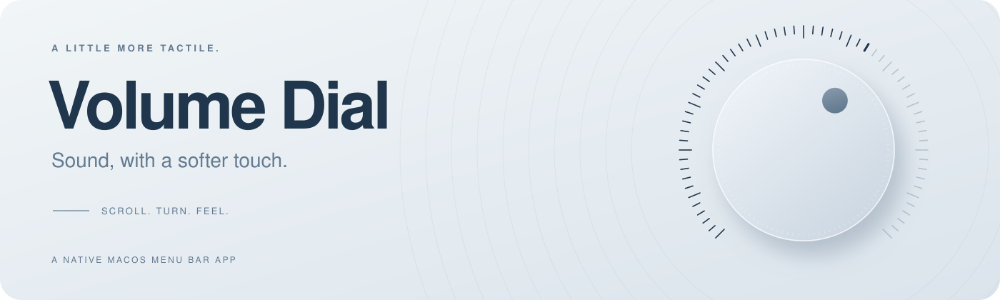
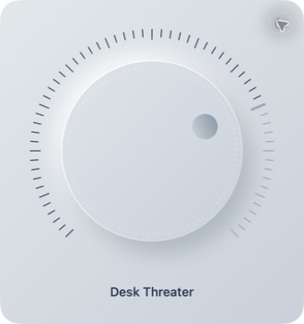
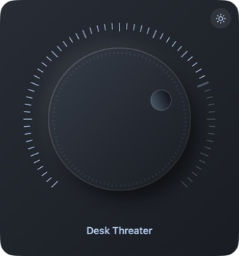

<p align="center"></p>

<picture>
  <source media="(prefers-color-scheme: dark)" srcset="docs/images/hero-dark.svg">
  
</picture>

<p align="center">A sculpted volume knob for your Mac. Always in the menu bar. Just a turn away.</p>
<p align="center">
  <a href="https://github.com/Gaurang-5/VolumeDial/releases/download/v1.1.0-beta.2/Volume-Dial-1.1.0-beta.2-Apple-Silicon.dmg"></a>
</p>
<p align="center"></p>
<p align="center"><a href="https://github.com/Gaurang-5/VolumeDial/releases/tag/v1.1.0-beta.2">Release notes</a> · <a href="#install-in-a-moment">Installation</a> · <a href="https://github.com/Gaurang-5/VolumeDial/issues/new/choose">Report an issue</a></p>

## Two finishes. One good feeling.

<table>
  <tr><th>Silver</th><th>Charcoal</th></tr>
  <tr>
    <td align="center"></td>
    <td align="center"></td>
  </tr>
</table>

Real app screenshots. Switch finishes with the sun/moon button, or follow your Mac’s appearance automatically.

## Small details, everyday comfort

| | |
| :--- | :--- |
| **Turn it your way**<br>Drag the dial, scroll over it, or use the keyboard for precise steps. | **Feel each adjustment**<br>Optional haptic feedback on supported Mac trackpads. |
| **Your output, right there**<br>Click the name beneath the dial to switch audio outputs. | **Together in tune**<br>Adjust controllable members of Audio MIDI Setup multi-output groups together. |
| **Beyond built-in speakers**<br>Control supported monitor speakers through DDC/CI. | **Quietly at home**<br>A native menu bar app with launch at login and no Dock icon. |

## Install in a moment

1. **[Download the DMG](https://github.com/Gaurang-5/VolumeDial/releases/download/v1.1.0-beta.2/Volume-Dial-1.1.0-beta.2-Apple-Silicon.dmg).**
2. Open it and drag **Volume Dial** into **Applications**.
3. Open Volume Dial from Applications. Look for the dial in your menu bar.

No Terminal commands, dependencies, or build steps are needed to install.

> **Beta installation:** this build is ad-hoc signed and not Apple-notarized, so macOS may block the first launch. Follow [Apple’s guidance for opening an app from an unidentified developer](https://support.apple.com/en-us/102445) only if you trust this download. A DMG does not remove that first-launch check.

## Made for Apple Silicon

Requires an **M-series Mac running macOS 14 or later**. Intel Macs are not supported.

Built-in speakers, headphones, and other outputs need writable Core Audio volume controls. External monitors need supported DDC/CI volume control through your cable, adapter, and port. A multi-output group adjusts only its controllable members. No virtual audio driver is installed.

Tested hardware includes **BenQ EW2790U + MacBook Pro Speakers**, individually and together. Other combinations are not all hardware-tested. See [device compatibility and connection tips](docs/COMPATIBILITY.md).

<details>
<summary><strong>Controls and shortcuts</strong></summary>

- Click the menu bar icon to open or close the dial.
- Scroll over the icon or dial; click or drag the dial to set a percentage.
- Focus the dial and use arrow keys for 1% steps; Shift + arrows for 10%.
- Click the output name to switch devices.
- Click the top-right sun/moon button to switch Light and Dark.
- Right-click for mute, appearance, haptics, launch at login, device limitations, and Quit.
- Press Escape or click outside to dismiss.

</details>

<details>
<summary><strong>Build, test, and contribute</strong></summary>

Built with SwiftUI, AppKit, Core Audio, and the bundled MIT-licensed m1ddc helper. Building requires Apple’s development tools and an accepted SDK license.

```sh
bash build.sh
swift test
make -C Vendor/m1ddc test
bash scripts/verify-build.sh
```

The build produces `dist/Volume Dial.app` and an Apple Silicon ZIP. Both executables target arm64 and macOS 14. Local builds are ad-hoc signed.

For read-only route diagnostics:

```sh
"dist/Volume Dial.app/Contents/MacOS/VolumeDial" --diagnose
```

See the [release guide](docs/RELEASING.md) for packaging and signing. Bug reports should include your Mac, macOS version, audio output, connection path, and steps to reproduce.

</details>

---

<p align="center">Made for the small moments between silence and sound.</p>
<p align="center">Open source under the <a href="LICENSE">MIT License</a> · <a href="THIRD_PARTY_NOTICES.md">Third-party credits</a></p>
